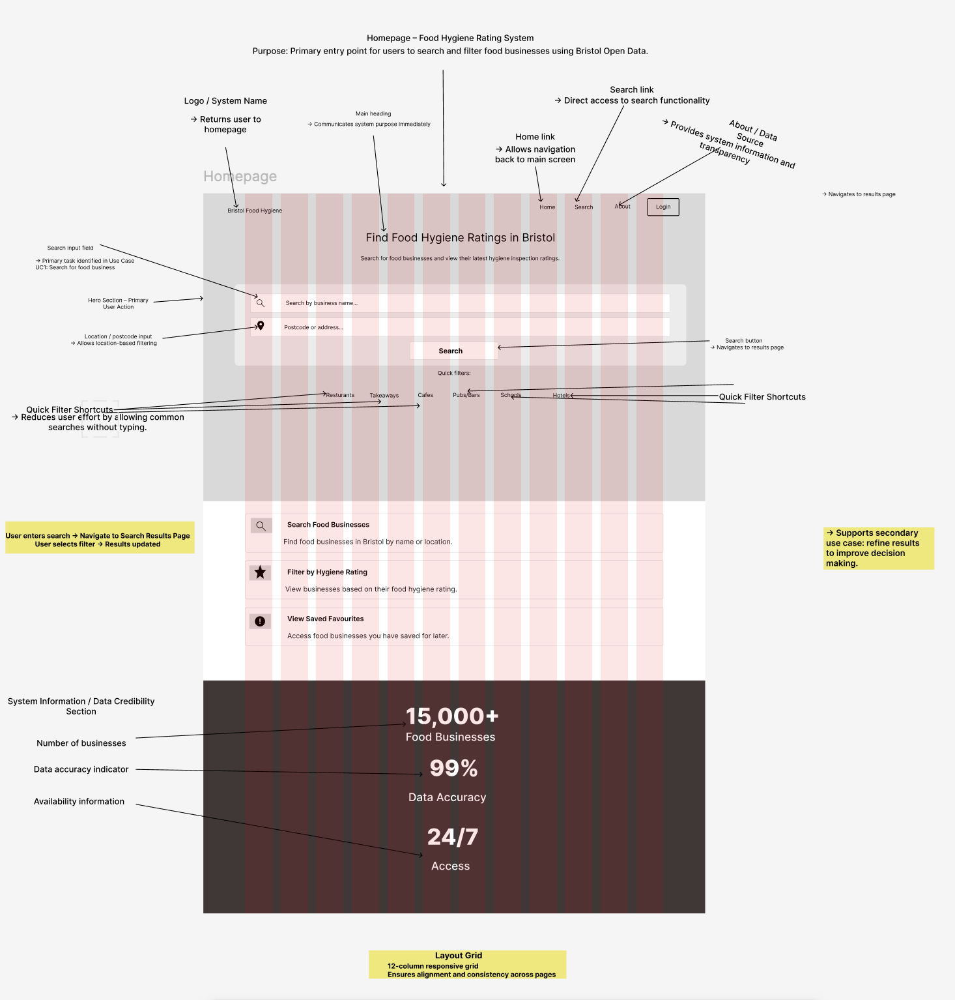
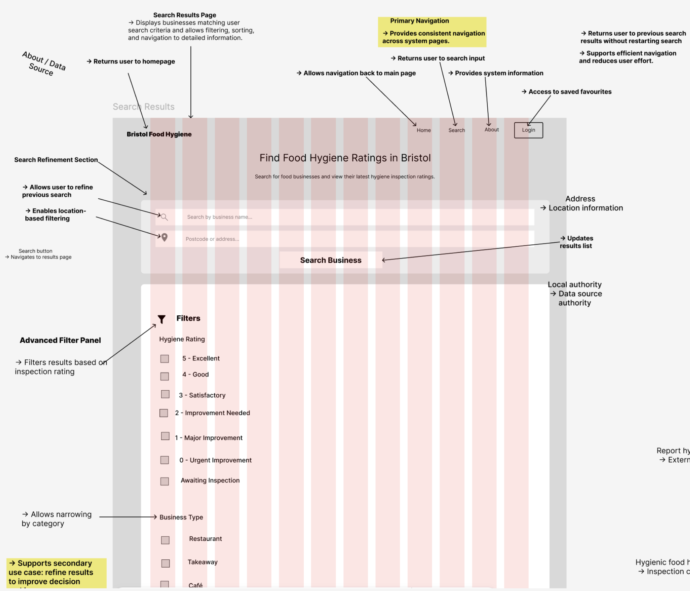
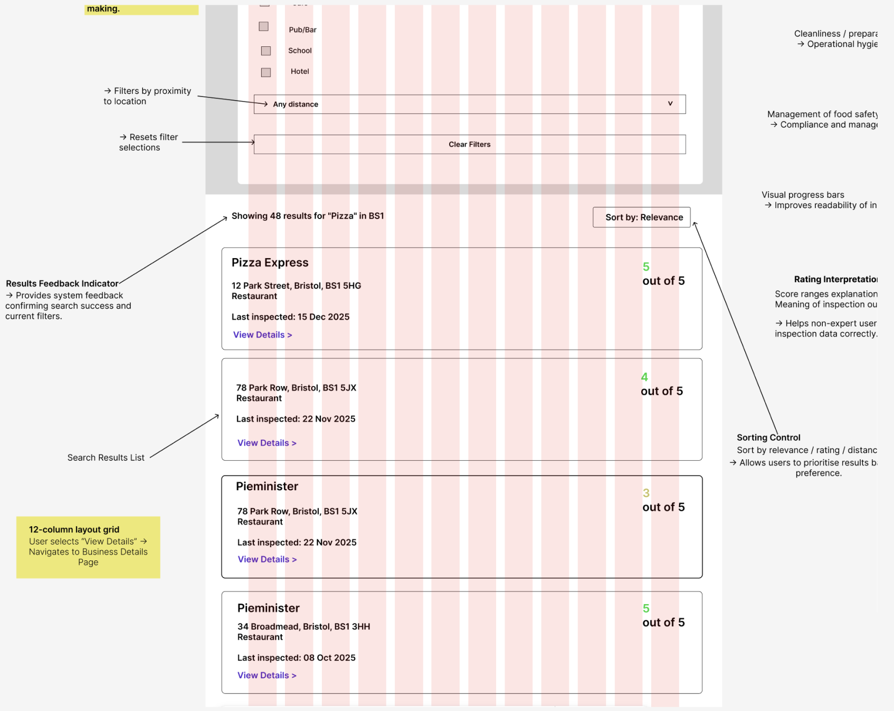
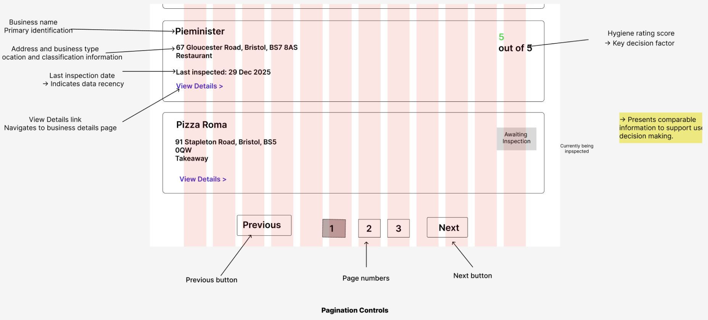
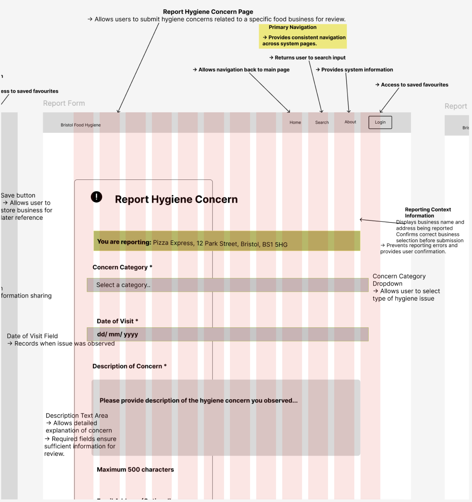
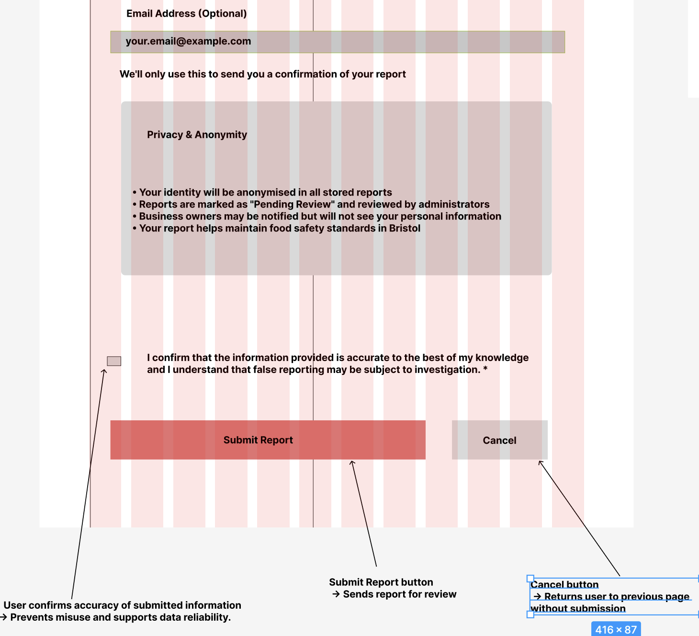
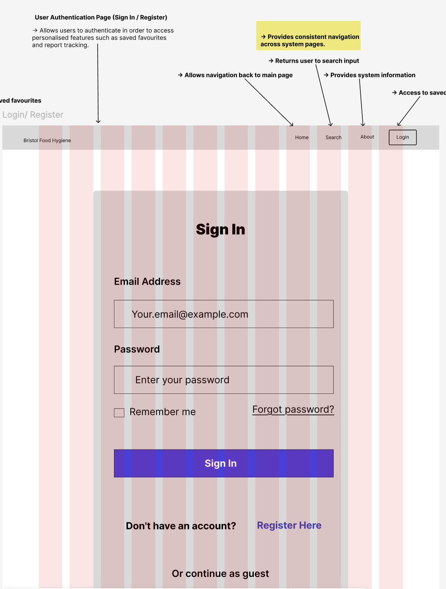
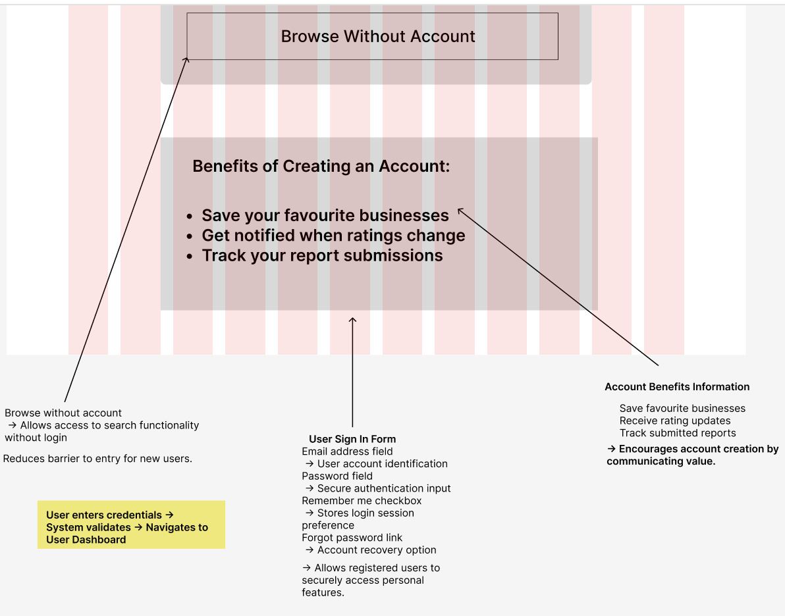

# 03 – Design

## 1. Design Overview

The design phase translates the system requirements into a structured user interface that supports efficient searching, filtering, and reporting of food hygiene information using Bristol Open Data.

The design focuses on:

- Supporting the primary user task of searching for food businesses quickly.
- Reducing user effort through filtering and shortcuts.
- Providing clear system feedback and navigation.
- Building user trust through data transparency and privacy information.
- Maintaining consistency across all pages using a responsive grid layout.

The interface was designed using wireframes before implementation in order to define layout, content hierarchy, and interaction flow.

---

## 2. Design Goals

The following goals guided the interface design:

- **Usability** – Users should be able to complete tasks with minimal effort.
- **Clarity** – Information should be easy to scan and understand.
- **Consistency** – Navigation and layout remain consistent across pages.
- **Accessibility** – Clear labels, readable spacing, and logical form structure.
- **Trust and Transparency** – Users understand where data originates and how it is used.

---

## 3. Layout and Grid System

A **12-column responsive grid** was used to ensure alignment and consistency across pages.

This allows:

- Consistent spacing between interface elements.
- Responsive behaviour across different screen sizes.
- Predictable positioning of navigation and content sections.
- Improved visual hierarchy and readability.

The grid structure ensures that components remain aligned throughout the system and supports scalability during implementation.

---

## 4. Navigation Design

The system uses a consistent top navigation bar across all pages containing:

- Home link (returns to homepage)
- Search access
- About / data source information
- Login access

This ensures users can always return to the main search functionality without becoming lost within the system.

Consistent navigation reduces cognitive load and improves overall usability.

---

## 5. Homepage Wireframe

The homepage acts as the primary entry point into the system and prioritises search functionality as the main user action.

### Homepage Wireframe

### Design Decisions

- Search input placed centrally as the primary action.
- Location or postcode input allows location-based filtering.
- Quick filter shortcuts reduce typing effort.
- System information section increases user trust and credibility.
- Clear heading communicates system purpose immediately.

---

## 6. Search Results Page

The search results page allows users to view and refine food business results based on search criteria.

### Search Results Wireframe

*Note: The wireframe is displayed across multiple images due to page length. These sections form one continuous interface.*

### Design Decisions

- Results displayed in a clear, scannable list format.
- Filtering options allow refinement without restarting the search.
- Hygiene ratings visually prioritised to support quick decision-making.
- Consistent navigation maintained for usability.
- Layout supports easy comparison between businesses.

---

## 7. Report Hygiene Concern Page

This page allows users to submit hygiene concerns related to a specific food business for review.

### Report Page Wireframe

*Note: These sections represent one continuous interface.*

### Design Decisions

- Business name and address displayed to prevent incorrect reporting.
- Structured form fields guide users through the submission process.
- Required fields ensure sufficient information for review.
- Privacy and anonymity information builds user confidence.
- Confirmation checkbox reduces accidental or false submissions.
- Primary submit button visually emphasised to guide completion.

---

## 8. Login and Register Page

The login and registration interface allows users to create accounts and access saved features within the system.

### Login and Register Wireframe

### Design Decisions

- Simple form layout reduces cognitive load.
- Clear separation between login and registration actions.
- Minimal required fields reduce friction during account creation.
- Consistent layout maintains familiarity across system pages.

---

## 9. User Dashboard

The user dashboard allows users to access saved businesses and manage their activity within the system.

### User Dashboard Wireframe

### Design Decisions

- Saved items easily accessible for future reference.
- Clear navigation back to search functionality.
- Information organised into manageable sections.
- Consistent visual structure improves usability.

---

## 10. Design Rationale Summary

The overall design prioritises task efficiency, clarity, and user confidence. Key design decisions include:

- Centralising search as the main user action.
- Using consistent navigation across all pages.
- Providing system transparency to improve trust.
- Structuring forms to reduce user error.
- Applying consistent layout principles using a grid system.

The use of wireframes ensured usability issues were identified before implementation, reducing the need for significant design changes during development.

